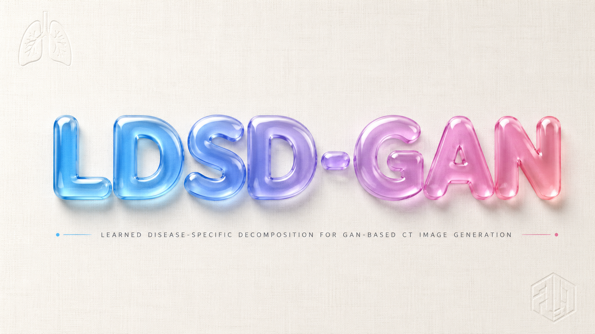

# LDSD-GAN

---

## Introduction

Log-Domain Speckle Decoupling GAN for Physically Consistent Few-Shot SAR Target Augmentation.

### Author

Meno

## Major Structure

- Ablation : The py files which finish the ablation experiment.
- Baseline_GAN : The py files based on the MLP-GAN
- cDCGAN : The py files including the major improved code, such as cDCGAN, AC-WGAN-GP and original LDSD-GAN named ACGAN_WGAN_GP_Physics.
- ConditionalGAN : The py files based on cGAN.
- Demonstration : The tool which can demonstrate the actual result visually.
- Discard : The code which was discarded.
- Evaluation_Tools : The evaluation tools.
- icon : The item's icon.
- MSTAR : The used dataset (MSTAR\PERSONAL_MSTAR).
